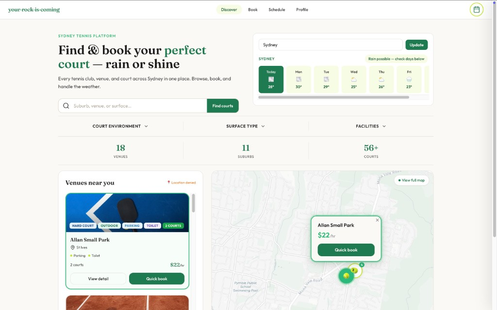
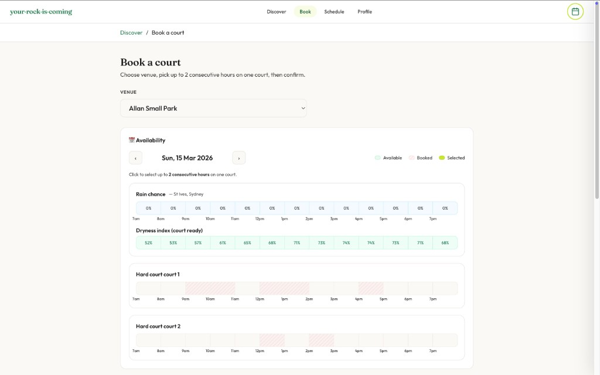

# your·rock·is·coming🎾

**One platform for Sydney tennis** — discover courts, check the weather, and book in seconds.

Built at **UniHack March 13-15, 2026** in 48 hours.

---

## Why We Built This

Sydney tennis players face a **fragmented ecosystem**:

- **Information silos** — Courts are scattered across council sites, club pages, and school portals, each with different booking tools.
- **No comparison** — Hard to compare surface types (grass, hard, clay), night lights, or pricing in one place.
- **Weather friction** — Rain makes outdoor courts unusable, yet refunds and reschedules are often clunky.

**your·rock·is·coming** centralizes venue discovery and introduces weather-aware booking flows, so players can plan around the rain and book with confidence.

> *The name comes from the idea that with persistence — like a small stone rolling upward — every player can be a champion in their own way.*

---

## Demo

### Main Page
Discover everything tennis in Sydney — search and filter courts, explore the map, and get a snapshot of available venues at a glance.



### Booking Page
A full booking flow in one place — select your court, pick a date and time slot, and see **rain chance** and **dryness index** before you confirm, so you never get caught off guard.



---

## Features

- 🗺️ **Map-Based Discovery** — Explore Sydney venues on an interactive map; click any marker for details and quick booking
- 🔍 **Smart Filtering** — Filter by surface (grass / hard / clay / synthetic), night lights, parking, and suburb
- 🌦️ **Weather-Aware Booking** — 7-day forecast, rain chance, and dryness index built into the booking calendar so you never get caught off guard
- 📅 **Full Booking Flow** — Pick venue → pick date → pick time slot → confirm; view and cancel bookings anytime

---

## Tech stack

| Layer   | Stack |
|--------|--------|
| **Frontend** | React 18, TypeScript, Vite 8, Tailwind CSS, Leaflet / react-leaflet, react-router-dom |
| **Backend**  | Node.js, Express, SQLite (better-sqlite3) |
| **APIs**     | Open-Meteo (weather, no key), optional OpenWeatherMap for backend |

---

## Quick start

### Option A: Full stack (frontend + backend)

From repo root:

```bash
npm install
npm run seed    # optional: seed DB (or npm run migrate)
npm run dev:all
```

- **Frontend:** http://localhost:3000  
- **Backend API:** http://localhost:3001  

The frontend proxies `/api` to the backend. Bookings and courts come from the API (and SQLite).

### Option B: Frontend only

```bash
cd frontend
npm install
npm run dev
```

Open **http://localhost:3000**. The app uses **mock venue data** and **localStorage** for bookings when the backend is not running (no need to start the server).

### SQLite / Node (staying with SQLite)

We keep **SQLite (better-sqlite3)** for the backend. If you see **"could not find the binding file"** or node-gyp errors (common on Windows), use **Node 20+** and run:

```bash
rm -rf node_modules && npm install
```

from the repo root (and run `rm -rf node_modules && npm install` inside `frontend/` if needed). Using the same Node version for both install and run avoids binding mismatches. On Windows, [WSL](https://docs.microsoft.com/en-us/windows/wsl/) or a Mac/Linux environment often avoids node-gyp issues.

---

## Project structure

```
├── frontend/           # React SPA (main app)
│   ├── src/
│   │   ├── App.tsx
│   │   ├── components/   # Nav, Hero, VenueCard, VenueMap, QuickBookModal, WeatherWidget, …
│   │   ├── pages/        # Home, MapPage, BookingsPage, CalendarBookPage, VenueDetail, …
│   │   ├── api/          # courts, bookings, weather client
│   │   ├── data/         # venues type, mock data, booking helpers
│   │   ├── hooks/        # useCourtsAsVenues, useFilteredVenues
│   │   └── context/      # BookingContext
│   ├── index.html
│   └── vite.config.ts   # dev port 3000, proxy /api → localhost:3001
├── server.js            # Express API
├── db/                  # SQLite (schema, seed, migrate)
├── package.json         # backend deps + scripts (dev, dev:all, seed, migrate)
└── README.md
```

- **Backend** serves the built frontend via `express.static('frontend/dist')`; run `npm run build` in `frontend/` before deploying.

---

<<<<<<< HEAD

=======
>>>>>>> 9050cc0 (fix: z-index layering (nav above filters, sidebar on top, View full map above map))
## Backend API

### Courts

| Method | Endpoint | Description |
|--------|----------|-------------|
| GET | `/api/courts` | List courts (optional: `q`, `surface`, `lights`, `parking`, `toilet`, `min_courts`, `suburb`) |
| GET | `/api/courts/:id` | Single court detail |
| GET | `/api/courts/:id/availability?date=YYYY-MM-DD` | Availability grid |

### Bookings

| Method | Endpoint | Description |
|--------|----------|-------------|
| POST | `/api/bookings` | Create booking |
| GET | `/api/bookings?email=xxx` | List bookings for an email address |
| DELETE | `/api/bookings/:id` | Cancel a booking |

### Weather

| Method | Endpoint | Description |
|--------|----------|-------------|
| GET | `/api/weather/:courtId?date=YYYY-MM-DD` | 7-day forecast for a single court |
| GET | `/api/weather/bulk?date=YYYY-MM-DD` | 7-day forecast for all courts |

Optional: set `OPENWEATHER_API_KEY` for live weather; otherwise backend returns fallback data.

---

## Scripts (root)

| Script | Description |
|--------|-------------|
| `npm start` | Backend only, port 3000 |
| `npm run dev` | Backend only, port **3001** (for dev:all) |
| `npm run dev:frontend` | Frontend dev (port 3000) |
| `npm run dev:all` | Backend (3001) + frontend (3000) |
| `npm run seed` | Seed SQLite DB |
| `npm run migrate` | Run DB migrations |

---
 
## Roadmap
 
### ✅ Built at UniHack 2026
- Court discovery with search, filters, and map
- Weather-aware booking flow (7-day forecast + rain warnings)
- Calendar-based time slot selection
- Booking management (create + cancel)
- Dual-mode: full stack or frontend-only demo
 
### 🔲 Future
- Coach matching and session booking
- Payment integration
- User accounts and booking history
- Push notifications for weather changes
- Social features — play with friends, find hitting partners

<<<<<<< HEAD
---

## Acknowledgements
 
- [Open-Meteo](https://open-meteo.com/) — free weather API, no key required
- [Leaflet](https://leafletjs.com/) / [react-leaflet](https://react-leaflet.js.org/) — interactive maps
- [Tailwind CSS](https://tailwindcss.com/) — utility-first styling
- [better-sqlite3](https://github.com/WiseLibs/better-sqlite3) — fast synchronous SQLite for Node

=======
## Roadmap

### ✅ Built at UniHack 2026
- Court discovery with search, filters, and map
- Weather-aware booking flow (7-day forecast + rain warnings)
- Calendar-based time slot selection
- Booking management (create + cancel)
- Dual-mode: full stack or frontend-only demo

### 🔲 Future
- Coach matching and session booking
- Payment integration
- User accounts and booking history
- Push notifications for weather changes
- Social features — play with friends, find hitting partners

---

## Acknowledgements

- [Open-Meteo](https://open-meteo.com/) — free weather API, no key required
- [Leaflet](https://leafletjs.com/) / [react-leaflet](https://react-leaflet.js.org/) — interactive maps
- [Tailwind CSS](https://tailwindcss.com/) — utility-first styling
- [better-sqlite3](https://github.com/WiseLibs/better-sqlite3) — fast synchronous SQLite for Node
>>>>>>> 9050cc0 (fix: z-index layering (nav above filters, sidebar on top, View full map above map))
